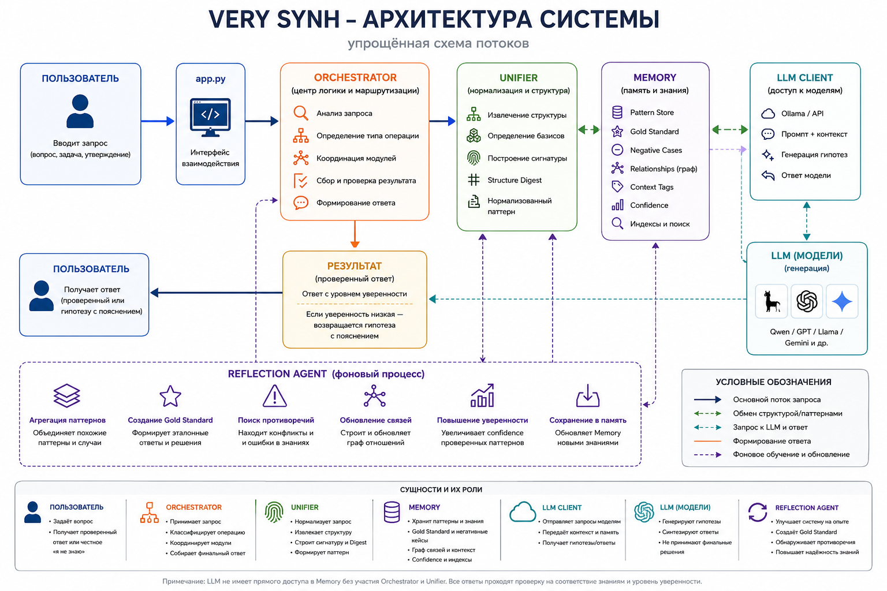

# VerySynh

> **An architectural proposal for structural verification of AI reasoning.**

**VerySynh stores not answers, but verifiable ways of arriving at them.**

VerySynh is an architectural proposal that separates **hypothesis generation**, **memory**, and **structural verification** into independent system responsibilities.

Instead of treating a language model as the single source of reasoning, VerySynh introduces an external verification layer that validates generated solution structures against accumulated, reusable experience.

---

# Why VerySynh?
 VerySynh Flow Diagram


Most AI systems ask a single language model to perform three fundamentally different tasks:

- reasoning;
- remembering;
- validation.

VerySynh separates these responsibilities.

The language model proposes hypotheses.

The memory stores structural solution patterns rather than text.

The orchestrator verifies whether the generated reasoning follows previously validated solution trajectories.

The goal is not to replace LLMs, but to make their reasoning **verifiable, reusable, explainable, and constrained by accumulated experience.**

---

# Who is this for?

VerySynh is intended for:

- AI researchers;
- AI engineers;
- software architects;
- contributors interested in:
  - Neuro-symbolic AI;
  - Memory-augmented systems;
  - Explainable AI;
  - Structural reasoning;
  - AI verification.

VerySynh is also designed for **end users**—developers, engineers, medical professionals, legal practitioners, and other domain specialists—who benefit from **verified and explainable reasoning** without needing to understand the underlying architecture.

End users interact with VerySynh as a **reliable reasoning partner**, not as a research tool.

---

# Core Components

- 🧠 **LLM** — generates hypotheses.
- 🧩 **Unifier** — extracts normalized structural representations.
- 🗂️ **Memory** — stores validated solution patterns, negative cases, and relationships between them.
- ⚖️ **Orchestrator** — validates generated reasoning against stored patterns and enforces structural constraints.
- 🔄 **Reflection Agent** — continuously refines, aggregates, and evolves memory.

---

# Core Principles

- Structural normalization before comparison.
- Pattern memory instead of text memory.
- Storage of negative cases alongside successful ones.
- Deterministic structural validation with heuristic retrieval.
- Multiple admissible solution trajectories.
- Continuous accumulation of validated experience.
- Independence from any particular LLM.

---

# High-Level Workflow

```text
        User
          │
          ▼
        LLM
          │
          ▼
     Unifier
          │
          ▼
       Memory
          │
          ▼
   Orchestrator
          │
     Accept / Reject
```

---

# What VerySynh is NOT

VerySynh is **not**:

- another LLM;
- another RAG implementation;
- another autonomous agent framework;
- a replacement for neural networks.

VerySynh is a verification architecture that complements existing language models rather than replacing them.

---

# Current Status

VerySynh is currently an **architectural specification and research proposal**.

Current progress:

- ✅ Architecture specification
- ✅ Concept formalization
- ✅ Public documentation
- 🚧 Prototype implementation
- 🚧 Experimental validation

---

# Roadmap

- [x] Core architecture
- [x] Documentation
- [ ] Prototype Unifier
- [ ] Pattern Memory
- [ ] Orchestrator
- [ ] Reflection Agent
- [ ] Experimental benchmarks

---

# Repository

| File | Description |
|------|-------------|
| **README.md** | Project overview |
| **OVERVIEW_EN.md** | Complete project overview (English) |
| **OVERVIEW_RU.md** | Полное описание проекта (Русский) |
| **docs/architecture.md** | Complete architecture specification |
| **docs/theory.md** | Formal concepts and theoretical foundations |
| **docs/faq.md** | Frequently asked questions |

---

# Contributing

VerySynh is currently in the specification stage.

Architectural discussions, constructive criticism, implementation ideas, experiments, and contributions are welcome.

---

## Contact

- GitHub Issues — for bug reports and discussions
- GitHub Discussions — for architectural questions
- Telegram: @mindress

---

## License

This project is licensed under the **Creative Commons Attribution-NonCommercial-ShareAlike 4.0 International (CC BY-NC-SA 4.0)** License.

See the **LICENSE** file for details.
